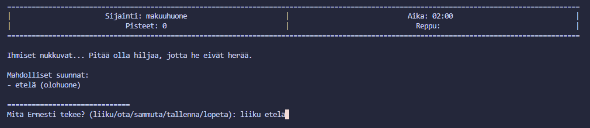

## Ernest's Adventures

Aatu Sivonen

## Ohjeet

Sinun pitää kerätä 50 pistettä ja palaamalla takaisin makuuhuoneeseen ennenkuin kello on 07:00.
Jos aika ehtii loppumaan, häviät pelin.  
Pisteitä saa keräämällä tavaroita, herkkuja tai sammuttamalla laitteita.

Peliä pelataan kirjoittamalla komentoja (liiku/ota/sammuta). Voit myös halutessasi tallentaa kirjoittamalla "tallenna", jolloin voit antamaasi nimeä vastaan ladata pelin myöhemmin.

esim. "liiku etelä" liikkuaksesi eteläiseen huoneeseen, "sammuta televisio" sammuttaaksesi TV:n tai "ota lankakerä" kerätäksesi esineen reppuun.

Pelissä on otettu kestävän kehityksen kannalta energiansäästö huomioon (päälle jääneet laitteet, valot yms.), joka edistää ympäristöllistä- ja taloudellista kestävyyttä.
